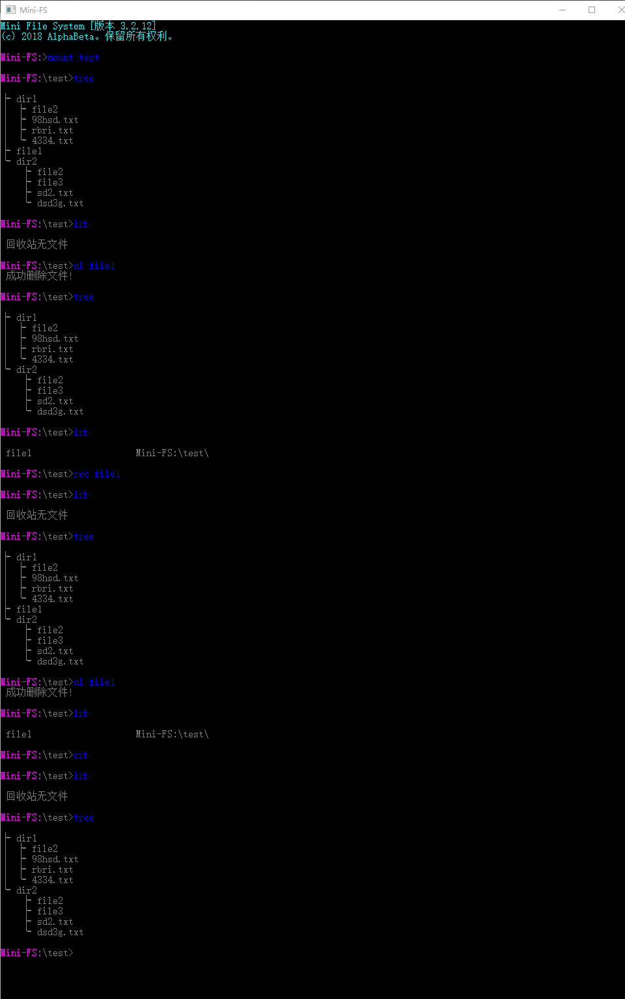

！！！The project has stopped development and maintenance.  
===  
# Mini-FS
2018小学期-文件系统  

        

## 一、命令列表
命令名|功能|格式|示例
:---:|:---:|:---:|---
create|创建空间|create <name> [size(可选)]|create SName 建立一个名为 SName 大小为 1G 的 Windows 文件作为存储空间;      create SName 2048 建立一个名为 SName 大小为 2G 的 Windows 文件作为存储空间
mount|安装空间|mount <name>	|	mount SName 在 Mini-FS 中安装(打开)空间 SName，为后续操作进行准备|
fmt|格式化空间|fmt [size(可选)]|fmt 初始化当前打开的 SName 空间，簇大小设置为 4KB;fmt 8 初始化当前打开的 SName 空间，簇大小设置为 8KB
close|退出空间|close| close 退出并关闭 Mini-FS 系统
dr|显示目录|dr|dr 显示当前目录下所有文件及文件夹
cp|拷贝文件|cp <name1> <name2>|cp wFName sFName 将文件从 Windows 空间中拷贝至 Mini-FS 空间中;cp sFName wFName 将文件从 Mini-FS 空间中拷贝至 Windows 空间中;cp sFName1 sFName2 将文件从 Mini-FS 空间中拷贝至 Mini-FS 空间中
dl|删除文件|dl <name>|dl sFName 将文件 sFName 从空间中删除	
tree|显示目录树|tree|tree 显示目录树	
move|移动文件|move <name1> <name2>|move name1 name2 将 name1 文件移动到 name2
att|显示文件属性|att <name>|att sFName 显示名为 sFName 的文件的文件属性(文件名、拓展名、创建时间、文件大小)	
help|帮助信息|help [命令名(可选)]|help 显示系统名称及含义； help create 显示 create 的指令格式等详细信息
end|退出程序|end|end 退出程序
mkdir|新建文件夹|mkdir <dirName>|mkdir 新建名为 dirName 的文件夹
touch|新建文件|touch <fileName>|touch 新建名为 fileName 的文件
lrb|显示回收站|lrb|lrb 显示回收站内容
crb|清空回收站|crb|crb 清空回收站	
map|显示文件占用块号|map <filename>|map filename 显示名为 filename 文件的占用的所有块号
cd|位置转移|cd <dirName>|cd dirName 移动到 dirName 目录下
opt|优化空间|opt|opt 优化当前空间，将文件尽可能连续存放
rec|恢复文件(夹)|rec <name>|rec name 恢复 name 文件(夹)
fd|查找文件(夹)|fd <name>|fd name 查找 name 文件(夹)

## 二、测试结果

### 2.1 命令推荐功能测试
   
当用户输入一个错误的命令时，系统会自动识别输入的字符串与已有的命令之间的相似度，并根据设定的阈值推荐用户较为可能想输入的命令。本次测试结果通过，本系统基本能够做到命令推荐功能。同时如果用户输入一个特别奇怪的命令时，本系统则不会推荐，因为偏差过大，判定是用户故意输错命令进行测试。   

### 2.2 查找文件命令测试
  
本系统全面支持使用正则表达式进行匹配搜索，以提高系统本身的搜索效率，由于支持了正则表达式，故对用户的体验也是更加友好，这更加方便了一些高级查找操作。在图例中，我们测试两种正则表达式，首先测试的是查找含有字母s的文本文件，结果比对，发现查找结果正确，接着测试的是文件类型，以查找文本文件为例，经过比对，发现结果依然正确。当使用了不正确的正则表达式时，程序可能崩溃退出。  

### 2.3 动态参数识别测试
  
上图中 create 命令的 -f 参数可以随意摆放位置，系统依旧能够正确处理，并对不同的错误情况给出相对应的错误提示。在 create 的 5 参数模式下默认第二个为空间名称，这是因为没有对空间大小设计参数符号。   

### 2.4 新建文件及文件夹和转移位置命令测试
  
  
通过上图可知，本系统能够正常识别文件及文件夹同时能够判断是否重复创建，在转移位置时，也能够正常识别路径是否正确。

### 2.5 回收站功能测试  
  
本系统支持删除文件、恢复文件以及清空回收站。  

### 2.6 帮助测试
  
测试结果正常。

### 2.7 查看文件占用块号命令、磁盘整理命令以及文件移动、文件拷贝命令测试  
  
注意使用的路径一定要为绝对路径。

### 2.8 压力测试  
  
开了 1024MB 空间，簇大小设置 1KB，生成 5 万份文件。

### 2.9 恢复性测试  
  
  
上图测试的是操作某些过后关闭命令行，重新打开加载内容还在，也即恢复性测试，通过测试结果，发现结果正常。同时在实际测试时发现，如果空间同目录下新生成一些文件则会导致系统无法识别。

### 2.10 容量测试  
 
向空间里添加外部文件必须使用 cp 命令，移动命令 move 只能对空间内部文件有效。本次空间开 1300M，向其中添加了近 1300M 的文件，结果正常。时间是原文件创建时间，非bug。   

### 测试后记
如果有朋友在运行本程序后仍然发现有 bug 是正常的，本次测试没有罗列所有的错误报告，只是较为简单的演示程序的可行性。

## 三、各模块详细实现
### 3.1 输入命令解析模块
#### 3.1.1 printFilePath 函数
概述：输出当前目录所在路径。   
流程：
1. 遍历当前目录容器并顺序输出。

#### 3.1.2 cmd 函数
概述：对输入命令进行解析并调用相应函数。   
流程：
1. 读取输入命令。
2. 将命令按词分割。
3. 根据指定命令和参数调用对应函数。
4. 输出执行结果。

### 3.2 帮助系统模块
#### 3.2.1 HelpOutput 函数
概述：显示单个命令帮助信息。    
流程：
1. 根据输入显示帮助信息。

#### 3.2.2 HelpDetail 函数
概述：显示单个命令详细帮助信息。  
流程：
1. 根据输入显示帮助信息。

#### 3.2.3 showHelp 函数
概述：显示指定命令帮助信息。  
流程：
1. 根据输入变量选择相应分支。
2. 输出对应分支命令的帮助信息。

### 3.3 硬盘读写模块
#### 3.3.1 readMBR 函数
概述：从硬盘读取MBR表到内存。  
流程：
1. 移动文件指针到文件头地址。
2. 读取 MBR 表数据。

#### 3.3.2 writeMBR 函数
概述：将 MBR 表由内存写入硬盘。  
流程：
1. 移动文件指针到头地址。
2. 写回 MBR 表数据。

#### 3.3.3 readCAB 函数
概述：从硬盘读取 CAB 表到内存。  
流程：
1. 移动文件指针到 CAB 表头地址。
2. 读取 CAB 表数据。

#### 3.3.4 writeCAB 函数
概述：将 CAB 表由内存写入硬盘。  
流程：
1. 移动文件指针到 CAB 表头地址。
2. 写回 CAB 表数据。

#### 3.3.5 readFAT 函数
概述：从硬盘读取 FAT 表到内存。  
流程：
1. 移动文件指针到 FAT 表头。
2. 读取 FAT 表数据。

#### 3.3.6 writeFAT 函数
概述：将 FAT 表由内存写入硬盘。  
流程：
1. 移动文件指针到 FAT 表头。
2. 写回 FAT 表数据。

#### 3.3.7 readCluster 函数
概述：从硬盘读取指定簇到内存。  
流程：
1. 移动文件指针到指定簇头地址。
2. 读取指定簇数据。

#### 3.3.8 writeCluster 函数
概述：将指定簇由内存写入硬盘。  
流程：
1. 移动文件指针到指定簇头地址。
2. 写回指定簇数据。

#### 3.3.9 readDirectory 函数
概述：从硬盘读取指定目录到内存。  
流程：
1. 移动文件指针到指定目录头地址。
2. 计算当前块剩余未读取目录条数和剩余目录总数。
3. 逐条读取目录直到当前块目录全部读出。
4. 由 FAT 表确定下块储存目录簇号。
5. 重复3、4直到剩余目录总数为零。

#### 3.3.10 rewriteDirectory 函数
概述：将指定目录由内存重新写入硬盘。  
流程：
1. 根据目录头簇号和 FAT 表将 CAB 表相应位清空。
2. 计算当前剩余未储存目录条数和剩余目录总数。
3. 移动文件指针到指定目录头地址。
4. 逐条储存目录到块中直到当前块满。
5. 将块写入硬盘中，由 CAB 表计算下个簇号。
6. 重复 3、4、5 直到剩余目录总数为零。

#### 3.3.11 newWriteDiretory 函数
概述：新建目录写入硬盘。  
流程：
1. 移动文件指针到指定目录头地址。
2. 将新建目录写入硬盘。

### 3.4 空间操作模块
#### 3.4.1 createSpace 函数
概述：新建文件系统空间，缺省状态下容量 1GB，簇大小 4KB。  
流程：
1. 检测空间路径和空间名合法性。
2. 创建空间文件，开辟空间内存并写入硬盘。
3. 初始化空间信息，包括 MBR、FAT、CAB 表。
4. 新建根目录文件并写入硬盘。
5. 关闭空间文件。

#### 3.4.2 mountSpace 函数
概述：打开文件系统空间，加载常驻内存信息。  
流程：
1. 检测该路径下是否存在系统空间。
2. 打开空间文件。
3. 将 MBR 表写入内存。
4. 将 FAT 表写入内存。
5. 将 CAB 表写入内存。
6. 将根目录作为当前目录写入内存。
7. 开辟文件缓冲区内存。

#### 3.4.3 formatSpace 函数
概述：格式化空间，缺省状态下簇大小 4KB。  
流程：
1. 改写 MBR 信息。
2. 改写 CAB 表信息。
3. 改写 FAT 表信息。
4. 清空文件目录并将根目录文件写回硬盘。

#### 3.4.4 closeSpace 函数
概述：关闭空间并将常驻内存信息写回硬盘。  
流程：
1. 将 MBR 写回硬盘。
2. 将 CAB 写回硬盘并释放空间。
3. 将 FAT 写回硬盘并释放空间。
4. 清空目录容器并释放空间。
5. 关闭空间文件。

### 3.5 文件操作模块
#### 3.5.1 showDirectory 函数
概述：显示当前文件目录。  
流程：
1. 输出当前所在路径。
2. 若当前在非根目录，则输出「.」和「..」目录表示当前目录和上级目录。
3. 遍历输出目录下文件信息，包括修改时间、是否为文件夹、文件大小、文件名等。

#### 3.5.2 treeDirectory 函数
概述：树形打印当前文件夹内文件目录。  
流程：
1. 判断当前目录下是否存在文件。
2. 若存在文件，则调用 treeRecur 函数遍历子目录并输出。

#### 3.5.3 occupyCluster 函数
概述：输出文件在系统中占用块号。  
流程：
1. 根据文件名遍历目录查找该文件。
2. 若成功找到文件，则根据 FAT 表循环输出文件占用块号。

#### 3.5.4 changeDirectory 函数
概述：改变当前所处文件目录位置。  
流程：
1. 判断是否进入上级目录，若是则抹除路径容器最后一个元素。
2. 判断是否进入当前目录，若是则直接退出函数。
3. 遍历当前目录寻找下级目录，若匹配则在容器尾添加当前目录，否则报错。

#### 3.5.5 makeDir 函数
概述：创建新文件夹。  
流程：
1. 查找是否存在同名文件夹。
2. 更新目录文件头。
3. 向文件头中新添目录信息，入口号由 CAB 表提供。
4. 由当前目录到根目录向上循环更新目录信息。
5. 将文件头重新写回硬盘。
6. 根据入口号创建新文件头并写入硬盘。

#### 3.5.6 createFile 函数
概述：创建新文件。  
流程：
1. 查找是否存在同名文件。
2. 更新目录头文件。
3. 向文件头中新添目录信息，入口号由 CAB 表提供。
4. 由当前目录到根目录向上循环更新目录信息。
5. 将文件头重新写回硬盘。

#### 3.5.7 findFile 函数
概述：利用正则表达式匹配查找目录及子目录下文件。  
流程：
1. 根据路径容器记录当前路径。
2. 调用 findRecur 函数递归遍历子目录并进行匹配

#### 3.5.8 copyFile 函数
概述：复制文件，支持从 Windows 复制到 Mini-FS 系统，从 Mini-FS 系统复制到 Windows 系统和从 Mini-FS 系统复制到 Mini-FS 系统三种模式。  
流程：
1. 判断复制文件模式。
2. 分割路径。
3. 在两个系统中分别匹配路径，确认路径合法性。
4. 若复制项目为文件，则新建文件并复制信息。
5. 若复制项目为文件夹，则递归调用此函数进行复制。

#### 3.5.9 moveFile 函数
概述：剪切文件。  
流程：
1. 分割路径。
2. 根据路径寻找目标文件。
3. 判断当前目录是否在被移动目录中。
4. 路径合法则复制，非法则报错。
5. 删除被移动文件。

#### 3.5.10 showAttribute 函数
概述：删除当前目录下指定文件。  
流程：
1. 遍历目录寻找指定文件。
2. 将指定文件的删除标记更改为已删除。
3. 向上到根更新目录信息。

#### 3.5.12 recoverFile 函数
概述：恢复指定目录文件。  
流程：
1. 检测路径合法性。
2. 将指定文件的删除标记更改为未删除。
3. 向上到根更新目录信息。

#### 3.5.13 showRecycleBin 函数
概述：显示回收站中文件。  
流程：
1. 调用 showRBRcur 函数由根目录进行递归遍历。

#### 3.5.14 emptyRecycleBin 函数
概述：清空回收站。  
流程：
1. 调用 emptyRBRecur 函数并传入根目录起始簇号。
2. 更新目录容器中目录信息。

#### 3.5.15 optimization 函数
概述：优化硬盘空间。  
流程：
1. 遍历 FAT 表，直到 $FAT[i]!=i+1$ 执行步骤 2。
2. 将当前文件下一储存与下个簇交换。
3. 重复执行步骤 2 直至当前文件连续。

#### 3.5.16 treeRecur 函数
概述：递归打印该目录下的所有文件。  
流程：
1. 输出本级文件名。
2. 调用自身递归进行子目录查找。

#### 3.5.17 findRecur 函数 
概述：递归匹配该目录以及改目录下的所有文件。  
流程：
1. 遍历目录进行正则表达式匹配。
2. 若当前目录为文件夹则调用自身递归匹配。

#### 3.5.18 delRecur 函数
概述：递归彻底删除该目录以及该目录下的所有文件。  
流程：
1. 清空该目录下所有文件的 CAB、FAT 表信息。
2. 文件夹递归清空。
3. 本级数据递归清空。

#### 3.5.19 showRBRecur 函数
概述：递归显示该目录以及该目录下的所有被删除文件。  
流程：
1. 调用自身递归显示信息。

#### 3.5.20 emptyRBReucr 函数
概述：递归清空回收站。  
流程：
1. 遍历文件目录删除文件信息。
2. 递归调用自身删除文件。

### 3.6 算法模块
#### 3.6.1 BitSet 函数
概述：位操作，将指定位置为 1。   
流程：
1. 计算指定位并置为 1。

#### 3.6.2 BtReset 函数
概述：位操作，将指定位置为 0。   
流程：
1. 计算指定位并置为 0。

#### 3.6.3 BitCheck 函数
概述：位操作，检查指定位取值。  
流程：
1. 计算指定位并返回其取值。

#### 3.6.4 BitFindRoom 函数
概述：位操作，查找第一个 0 值位号。  
流程：
1. 按字节寻找直到该字节每位值不全为 1。
2. 在字节中按位寻找并返回第一个 0 值位号。

#### 3.6.5 LevenDistance 函数
概述：最小编辑距离算法。  
流程：
1. 根据距离矩阵计算最小编辑距离。

#### 3.6.6 Min 函数
概述：计算三个数字的最小值。  
流程：
1. 取前两个数字最小值。
2. 将最小值与第三个数字取最小值。

#### 3.6.7 cutPath 函数
概述：将路径按 「\」分割。  
流程：
1. 遍历字符串，遇到「\」字符则截断。
2. 将截断部分放入路径容器中。

## 四、协议
  
Mini-FS 基于 MIT 协议进行分发和使用，更多信息参见协议文件。
